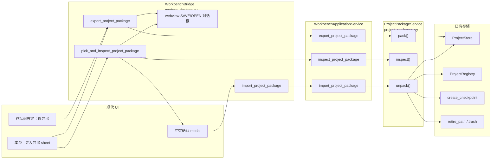
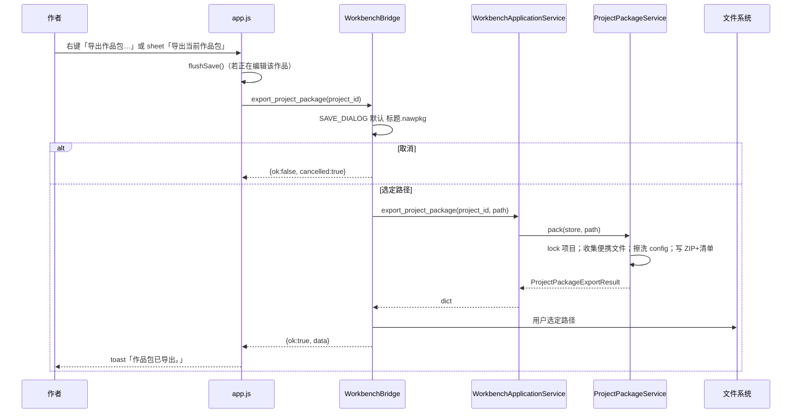
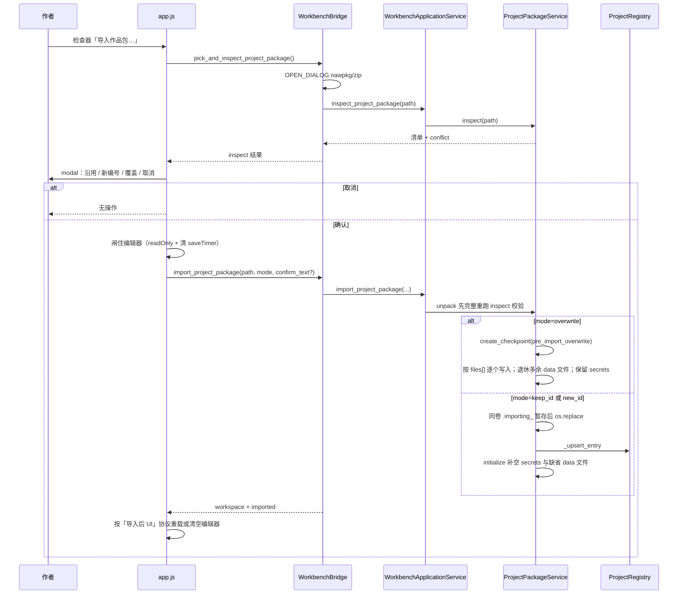

# 导入导出（作品包）设计文档

| 字段 | 内容 |
| --- | --- |
| 文档标题 | Novel Agent Workbench：导入导出（作品包） |
| 作者 | 待定 |
| 日期 | 2026-08-31 |
| 状态 | Draft |
| 产品名 | 导入导出 |
| 主键格式 | `novel_agent_workbench.project_package.v1` |
| 主界面 | Windows 现代 UI（pywebview / Edge Chromium） |

---

## Overview

当前工作台只能把**已确认章节**导出为 TXT 文稿（`TxtManuscriptExportService.export_confirmed_chapters`）。作者无法把一部小说的完整工作台状态——草稿、大纲、人物/世界观、记忆银行、审稿记录、章节工作流——打包带走，也无法在另一台机器或另一个项目库里恢复。内部检查点 ZIP（`ProjectStore.create_checkpoint`）只服务于同项目回滚，不能当作用户可携带的作品包。

本设计新增一条与 TXT **并列、互不替代** 的产品能力：**导入导出**。一次导出一部作品为一个带清单的 ZIP 作品包（默认扩展名 `.nawpkg`）；导入时校验清单、排除密钥、处理 `project_id` 冲突，并把作品登记进当前 `ProjectRegistry`。入口仍只有两个表面：左侧作品树右键只提供「导出作品包…」（针对被右键的那一部）；右侧「本章」检查器的「导入导出」同时提供导出当前作品与导入作品包。空项目库仍可从检查器导入。

---

## Background & Motivation

### 当前状态

| 能力 | 现状 |
| --- | --- |
| 已确认章节 TXT | 已实现。`exports.py` → `WorkbenchApplicationService.export_confirmed_chapters_txt` → `WorkbenchBridge.export_txt` / Tk `export_txt_dialog` |
| 作品级打包导出 | **不存在** |
| 作品包导入 | **不存在** |
| 跨机器迁移整部小说 | **不存在** |
| `export_settings.json.zip_enabled` | 占位。`config.py` 默认 `zip_enabled: true`，但 UI 文案仍是「DOCX/ZIP: 开发中」，且语义是**文稿 ZIP**，不是作品包 |
| 内部检查点 | `backups/checkpoints/*.zip` + `checkpoint_manifest.json`，`format: novel_agent_workbench.project_checkpoint.v1`。默认排除密钥。`restore_checkpoint` **要求** `manifest.project_id == self.project_id` |

现代 UI 现有导出入口：

- 右侧检查器「本章」：`modern_ui/index.html` `#exportBtn`「导出 TXT」→ `app.js` 调用 `export_txt`
- 记录与诊断 studio：`studio.js` 在 `confirmed` / `export` 页同样挂「导出 TXT」
- 作品树右键（`app.js` `menuItemsFor` kind=`project`）：打开、重命名、生成、审稿、资料库、打开文件夹、删除。**没有**导入导出

经典 Tk（`desktop_app.py`）同样只有 TXT，文案写明「DOCX/ZIP: 开发中」。本设计以现代 UI 为唯一必做表面。

### 痛点

1. 换电脑、换项目库路径、或备份一部进行中的长篇时，只能手拷 `workspace_projects/<project_id>/`。该目录含 `data/secrets.local.json`、`backups/` 下成百上千 `.bak` 与检查点 ZIP、以及 `locks/`。
2. 实测 EXE 数据根 `dist/NovelAgentWorkbench/用户数据/workspace_projects` 中，单部作品 `data/` 通常约 60–230 个 JSON；`backups/` 可达 300–2000+ 个文件。手拷会把密钥和巨型回滚历史一并带走。
3. `ProjectStore.restore_checkpoint` 不能跨项目、跨库使用；误把检查点当作品包打开会失败或行为含糊。
4. Charter 第 9 条：跨项目导入必须是 **copy with new ids**，禁止运行时动态引用。今天没有任何用户路径兑现这条。

### 与 Charter 第 7 条的关系

Charter 规定「只有已确认章节可以更新正式上下文、Memory Bank、RAG 与 export」。这里的 export 指**出版/文稿导出**，不是工作台快照。作品包是工作台项目的可携带快照：导入后草稿仍是草稿，不会自动变成确认稿，也不会触发 Memory Bank / 文稿导出副作用。TXT 文稿导出规则保持不变。

---

## Goals & Non-Goals

### Goals

1. 把**一部**作品打包为单一文件，可在当前或其他项目库导入。
2. 包内包含作者的工作台数据：项目元数据、项目配置（无密钥）、规划库、记忆银行、草稿、已确认章节、审稿与相关索引/工作流。
3. 包内**永不**包含 API Key、`data/secrets.local.json`、`global_secrets.local.json`、软件级全局设置与密钥。
4. 导入到当前 `ProjectRegistry` 所指向的项目库；冲突时提供取消 / 新编号导入 / 显式确认覆盖。
5. 保留现有「导出 TXT」。新产品名与按钮文案使用中文：**导入导出**。
6. 入口仅两个表面：作品树右键（只导出被右键的作品）；右侧「本章」检查器「导入导出」（导出当前作品 + 导入作品包）。不在树上挂导入，避免右键 A 却覆盖 B。
7. 复用检查点已验证的 ZIP + 清单 + sha256 + 路径安全 + `.trash` 退休，而不是平行发明一套归档栈。
8. 主表面是现代 UI。后端经 `WorkbenchApplicationService` 门面暴露，便于测试与 CLI 冒烟。

### Non-Goals（明确不做）

- 云同步、账号、远程备份
- DOCX / 文稿 ZIP / 批量导出全部作品
- 把 TXT 与作品包合并成一个按钮
- 经典 Tk 菜单（可作后续跟进，本设计不实现）
- 作品树空白处第三入口、作品树右键导入、设置页第三入口、记录与诊断里的新主按钮（记录页只改文案，避免第三个操作面）
- 导入后自动配置模型、拷贝密钥、自动确认草稿、自动生成记忆
- 把内部 `project_checkpoint.v1` 当作用户作品包导入（检验时明确拒绝）
- 改变 `ProjectStore.create_checkpoint` / `restore_checkpoint` 的语义
- 重载 `export_settings.json.zip_enabled` 作为本功能开关（它属于文稿导出占位）
- 新增 MCP / 后台服务 / 数据库

---

## Key Decisions

1. **作品包格式独立于检查点，但共享 ZIP 实现。**  
   检查点是同项目回滚（`restore_checkpoint` 校验 `project_id` 相同，写入 `backups/checkpoints/`）。作品包是跨库、跨机器的用户产物。共用 `zipfile.ZIP_DEFLATED`、相对路径白名单、sha256 清单、默认排除 `backups/`、`locks/`、`*.trash`、密钥。清单文件名与 `format` 字符串必须不同，避免两类 ZIP 互开。

2. **默认扩展名 `.nawpkg`（内容仍是 ZIP）。**  
   保存对话框默认 `《标题》.nawpkg`；打开对话框同时接受 `*.nawpkg` 与 `*.zip`。用户可用系统解压工具打开检查内容。不引入自定义二进制容器。

3. **导出范围 = 检查点便携文件集 + 作品包专用拒绝表。**  
   共用检查点规则（`backups/`、`locks/`、`*.trash`、`data/secrets.local.json`），再叠加包专用拒绝：`*.nawpkg`、`*.zip`、`*.env`、`**/.env`、`*secrets*.json`、`checkpoint_manifest.json`、以及任何落在 `store.root` 之外的名字。禁止把输出路径放在 `store.root` 内（防止下次导出把上一份作品包嵌进去）。`data/config.json` **不得**按磁盘字节 `archive.write`：必须先在内存擦洗 `api_key` 再 `writestr`，清单哈希针对擦洗后的字节。

4. **导入默认防覆盖；非法 id 不能沿用。**  
   - 目标库**没有**相同且合法的 `project_id`：默认「沿用原编号」（方便换机器）。  
   - 目标库**已有**相同 `project_id`，或包内 id 无法通过 `validate_project_id`：默认「作为新作品导入（新编号）」；隐藏「沿用原编号」。覆盖必须输入「确认覆盖」，且先打 `pre_import_overwrite` 检查点。  
   权威 `project_id` 是包内 `project.json` 的字段；清单 `source.project_id` 必须与之一致，否则 inspect 失败。覆盖不是默认路径。

5. **不调用 `restore_checkpoint` 做导入；也不把它单独当作覆盖回滚。**  
   它拒绝 `project_id` 不一致，假定 ZIP 已在项目 `backups/` 内，且**只写回清单中的文件、不退休覆盖后多出来的文件**。导入走 `ProjectPackageService`。覆盖回滚使用包专用 `restore_pre_import_overwrite`：先 `restore_checkpoint`，再按检查点清单退休 `data/` 中的多余文件（跳过 `secrets.local.json` 与 `*.trash`）。不修改全局 `restore_checkpoint` 语义。

6. **不调用 `ProjectRegistry.create_project` 覆盖已有作品。**  
   `create_project` 在目录已存在时会 `initialize()` 并改写 `project.json`，**不是**唯一性 API。导入在目标已存在时必须走覆盖专用路径。

7. **覆盖时保留本机 `data/secrets.local.json`。**  
   包内无密钥。覆盖替换 `project.json` 与 `data/` 中的便携文件，但留下本机密钥，避免作者在同机「用包覆盖自己」后丢 Key。新编号导入则 `initialize()` 写出空的 `secrets.local.json`。

8. **TXT 与作品包是两条动作；树上不挂导入。**  
   检查器保留「导出 TXT」，在其下新增「导入导出」（导出当前作品 + 导入作品包）。作品树右键只插入「导出作品包…」（针对被右键的那一部）。导入不出现在项目右键：冲突/覆盖目标是**包内** `project_id`，若挂在「交换世界」上却覆盖「贞操逆转世界」，比缺少入口更危险。空库从检查器导入。

9. **门面保持瘦。**  
   `WorkbenchApplicationService` 只委托 `ProjectPackageService` + `ProjectRegistry`，不在门面里写 ZIP。这与现有 `export_confirmed_chapters_txt` 对 `TxtManuscriptExportService` 的关系一致，也不违背契约里「门面不直接实现 export generation」——实现落在专用服务。

10. **现代 UI 为 MVP 表面；Tk / CLI 不是产品入口。**  
    CLI 只为测试与开发者冒烟存在。Tk 标明 follow-up。

11. **无功能开关。**  
    本地桌面、用户主动点选即使用。不借用 `zip_enabled`。

12. **导入不重写章节/草稿 ID；v1 作品包仅保证 Windows 路径可携带。**  
    重映射的只是 `project_id`（目录名 + `project.json`）。章内 ID、草稿 ID 保持不变。抽样 `data/**` 中无 `project_id` 字段。索引里的 `path` 由 `Path.relative_to(store.root)` 写入，现网数据为 Windows 反斜杠（JSON `data\\drafts\\...`）。v1 不在打包时改写这些字段（改 JSON 不便宜，且要碰到所有索引 schema）。跨 POSIX 导入是非目标；文档与错误文案按 Windows 桌面产品描述。

13. **导入成功后编辑器缓冲必须匹配磁盘，或被清空。**  
    `saveDraft()` 只认 `$("editor").readOnly`，不认 `state.closing`。`selectProject` 在 id 不变时不重载正文，id 变化时也不清 `draftId` / 编辑器。`applyWorkspaceResult` 只在当前 `draft_id` 从树里消失时清空。因此：覆盖同 id 后若只 `loadOverview`，或 `new_id` 后只 `selectProject`，旧缓冲会经 `saveDraft(新 projectId, 旧 draftId, 旧正文)` 打到错误目标。PR 3 必须执行下文「导入后 UI」协议：同 id 成功则 `loadDraft({force:true})`，`loadDraft` 失败或导入了另一部则先清空缓冲再解锁。

14. **`keep_id` / `new_id` 成功 toast 附带一句配密钥；覆盖与导出不附。**  
    文案：`请在模型设置中重新填写 API Key。` 覆盖同机保留 `secrets.local.json`，不提示。不自动打开模型 studio。

15. **`unpack` 必须重跑与 `inspect` 相同的校验，且禁止 `extractall()`。**  
    inspect 与 unpack 之间 ZIP 可能被替换。只按 `files[]` 逐个 `archive.read` → 校验 sha256 → 原子写入（同 `restore_checkpoint`）。CLI 不经 UI inspect 也必须安全。

16. **新目录导入在 `projects_root` 同卷暂存，不用系统临时目录跨卷 `shutil.move`。**  
    本机 `%TEMP%` 在 `C:`、项目库常在 `I:\` 或其它盘。`os.replace` 不能跨卷；`shutil.move` 会 copy+delete，半成品目录一旦写出 `project.json` 就会被 `_discover_missing_entries` 登记。暂存名 `.importing_<stamp>`（点号使 `validate_project_id` 失败，discovery 会 `continue`），写完后同卷 `os.replace` 到 `target_id`。  
    **禁止**对暂存名调用 `ProjectStore.open`：`open` 一律 `validate_project_id`，`.importing_*` 会被拒；若改用目标 id 打开，文件会写进 `projects_root / target_id`，discovery 竞态又回来。暂存写入用模块级 `atomic_write_bytes_file`（与 `_atomic_write_bytes` 相同的 tempfile / `fsync` / `os.replace`），根目录是 staging：`join(staging, safe_relative).resolve()` 必须 `relative_to(staging)`。`os.replace(staging, target)` 之后才 `ProjectStore.open(projects_root, target_id).initialize()`。

---

## Proposed Design

### 架构



业务逻辑不进 `app.js`。JS 只负责入口、对话框结果展示、冲突选择与 toast。ZIP / 校验 / 注册表写入全部在 Python。

### 模块落点

| 模块 | 职责 |
| --- | --- |
| **新建** `src/novel_agent_workbench/project_packages.py` | `ProjectPackageService`：打包、检验、解包、密钥扫描、冲突策略 |
| `storage.py` | 抽出 `safe_archive_relative_path`、`atomic_write_bytes_file`。检查点排除函数保持原语义；作品包叠加专用拒绝表。**不**改变 `restore_checkpoint`。暂存目录不得 `ProjectStore.open` |
| `exports.py` | **不动** TXT 服务 |
| `application_service.py` | 三个门面方法，委托 |
| `cli.py` | 三个冒烟命令 |
| `audit.py` | PR 4 可加 namelist 扫描；**密钥门禁以 PR 1 的 pack/inspect 测试为准**，审计不是唯一闸门 |
| `modern_desktop.py` | 文件对话框 + bridge API |
| `modern_ui/index.html` `app.js` `app.css` | 两个入口与 sheet/modal |
| `config.py` `DATA_FILE_DEFAULTS["export_settings.json"]` | **不改语义**；仅 UI 文案区分文稿 ZIP 与作品包 |

### 作品包物理格式

文件是标准 ZIP（`ZIP_DEFLATED`）。逻辑布局：

```text
package_manifest.json          # 根清单，UTF-8 JSON
project.json
data/config.json
data/planning_library.json
data/memory_bank.json
data/drafts_index.json
data/drafts/*.json
data/confirmed_chapters.json
data/confirmed_chapters/*.json
data/reviews_index.json
data/reviews/*.json
data/chapters_workflow.json
data/commit_log.json
data/export_settings.json
…其余 data/ 便携文件
```

禁止出现：

```text
checkpoint_manifest.json       # 若出现 → 视为检查点或损坏包，拒绝
data/secrets.local.json
*secrets*.json
global_secrets.local.json
global_settings.json
backups/**
locks/**
**/*.trash
**/*.nawpkg
**/*.zip
**/.env
**/*.env
```

`package_manifest.json` 不计入 `files[]` 清单（与检查点把 `checkpoint_manifest.json` 写进 ZIP、但不进 `files` 的方式相同）。

#### 清单 schema（v1）

```json
{
  "format": "novel_agent_workbench.project_package.v1",
  "schema_version": 1,
  "package_id": "20260831T120000123456Z",
  "exported_at": "20260831T120000123456Z",
  "workbench_version": "0.1.0",
  "source": {
    "project_id": "novel",
    "title": "贞操逆转世界",
    "project_schema_version": 1,
    "config_schema_version": 4
  },
  "include_secrets": false,
  "exclusions": [
    "backups/",
    "locks/",
    "*.trash",
    "data/secrets.local.json",
    "*.nawpkg",
    "*.zip",
    "*.env"
  ],
  "inventory": {
    "confirmed_chapter_count": 9,
    "draft_count": 14,
    "review_count": 10,
    "planning_item_count": 4,
    "memory_bank_item_count": 1,
    "file_count": 48,
    "bytes": 153600
  },
  "files": [
    {
      "path": "project.json",
      "size": 212,
      "sha256": "…"
    }
  ]
}
```

字段约束：

- `format` 必须精确等于 `novel_agent_workbench.project_package.v1`
- `include_secrets` 必须为 `false`；为 true 则拒绝导入
- `files[].path` 必须通过 `safe_archive_relative_path`（禁止绝对路径、盘符 `:`、`..`、空段）
- 每个 `files[]` 条目的 sha256 / size 必须与 ZIP 内**实际读出的字节**一致（擦洗后的 `config.json` 以写入 ZIP 的字节为准，不是磁盘原件）
- ZIP `namelist()` 减去 `package_manifest.json` 后必须与 `files[].path` 集合相等（禁止额外成员，包括目录条目；打包时不写目录条目）
- `source.project_id` 必须等于包内 `project.json` 的 `project_id`，否则 inspect 失败：「作品包清单与 project.json 的编号不一致。」
- `workbench_version`：`importlib.metadata.version("novel-agent-workbench")`；未安装发行版（源码 unittest）时回退为 `pyproject.toml` 的 `0.1.0`。仅诊断用，导入不因版本字符串拒绝。
- `inventory.bytes`：已归档成员的**未压缩字节合计**（含擦洗后的 config）。`export` 返回的 `bytes_written` 是 ZIP 文件在磁盘上的大小。二者不要混用。
- `inventory` 计数来自导出时读取的索引，供 UI 展示；导入不把它当权威，权威是文件清单与哈希。

### 包含 / 排除清单

**包含（便携工作台状态）**

- `project.json`
- `data/config.json`（可含 `api_key_ref` **名称**，不得含明文 key）
- `data/planning_library.json`（总纲、章节计划、人物、世界观）
- `data/memory_bank.json`
- `data/export_settings.json`、`scoring_profile.json`、`revision_policy.json`
- 草稿与索引：`data/drafts/`、`data/drafts_index.json`
- 已确认章节与索引：`data/confirmed_chapters/`、`data/confirmed_chapters.json`
- 审稿、改写、手改及相关索引
- `data/chapters_workflow.json`、`data/commit_log.json`
- 风格基线 / 检查 / 建议、正式上下文计划、Memory apply 预览、Provider 调用日志（元数据）、语料剖面等 **项目内** 产物

**排除（默认，不可配置）**

| 路径 | 谁排除 | 原因 |
| --- | --- | --- |
| `backups/`、`locks/`、`*.trash` | 检查点 + 作品包 | 体积、锁、垃圾 |
| `data/secrets.local.json` | 检查点（默认）+ 作品包（强制） | Charter 第 8 条 |
| `*.nawpkg`、`*.zip` | **仅作品包** | 防止把上一份包或检查点 ZIP 嵌进下一份 |
| `*.env`、`**/.env`、文件名含 `secrets` 的 `*.json`（含 `global_secrets.local.json`） | **仅作品包** | 密钥/环境文件；检查点今天不会排除 `.env`，包必须排除 |
| `checkpoint_manifest.json` | **仅作品包**（导入侧再拒） | 防止检查点被当作品包 |
| 项目库根上的 `global_settings.json`、`registry.json`、`model_catalog_cache.json` | 遍历边界 | 不在 `ProjectStore.root` 内 |

共享 helper **不是** `_should_exclude_from_checkpoint` 的纯别名：

```text
is_excluded_from_portable_archive(relative, *, include_secrets=False)
    = checkpoint 规则
    + 作品包拒绝表（*.nawpkg / *.zip / *.env / *secrets*.json / checkpoint_manifest.json）
```

检查点继续调用原 `_should_exclude_from_checkpoint`，行为不变。PR 1 种一棵 `data/.env` 断言它不进包。

**`data/config.json` 的写入路径（擦洗，不是注释）**

`providers.py` 已拒绝把明文 `api_key` 写入角色配置；现网样本也只有空 `api_key_ref`。擦洗是防御 `audit.py` 的 `raw_provider_api_key_in_config`。实现必须是：

1. 读磁盘 JSON。
2. 删除 `model_roles.<role>.api_key`、`model_roles.<role>.settings.api_key`，以及这些对象上任何名为 `api_key` 的键。保留 `api_key_ref`。
3. `json.dumps(..., ensure_ascii=False, indent=2, sort_keys=True) + "\n"`，UTF-8 编码。
4. **这些字节**的 sha256 / size 写入清单；`archive.writestr("data/config.json", washed_bytes)`。
5. 其它成员仍从磁盘读、哈希、`archive.write`。
6. 不修改磁盘上的项目文件。

若实现误用检查点的 `archive.write(self.root / path)` 循环，ZIP 会带上未擦洗的磁盘 `config.json`，清单要么与擦洗字节对不上，要么会把 key 再导入回去。PR 1 必须种假 key 并断言它不在 ZIP 字节里，往返后的 config 无 `api_key` 字段。

### 导出流程



实现要点：

- 与 `export_txt` 相同：对话框必须在 pywebview API 线程。打包同步执行——排除 `backups/` 后典型作品为几十到二百余 JSON，预期 **< 2s**。若 profiling 超过 2s，再升级为 `_run_job` 后台线程；首版不必。
- Bridge 若 `_busy`：返回与 `_run_job` 完全相同的字符串 `已有任务正在进行，请等待完成。`（`export_txt` 今天不检查 `_busy`；作品包要查）。JS 在调用前再跑 `blockIfGenerating()`（toast「请等待当前生成完成。」）。
- 持有 `store.lock()` 时若抛 `ProjectLockError`：翻译为中文 `作品正在保存或生成，请稍后重试。`，不要把英文 `Project is already locked: …` 丢给 UI。
- 默认文件名复用 TXT 的净化：`re.sub(r'[<>:"/\\|?*]+', "_", title)` + `.nawpkg`。
- **拒绝** `Path(output_path).resolve()` 落在 `store.root.resolve()` 之内。中文错误：`不能把作品包保存到作品目录内。`
- 目标已存在时由系统保存对话框确认覆盖（操作系统行为），后端再 `os.replace` 原子替换临时 ZIP。临时 ZIP 必须写在**输出路径同目录**（同卷），不要写到 `%TEMP%` 再跨盘 move。
- 写入协议：同目录 `.{name}.tmp`，`fsync` 后 `os.replace`。失败则 `retire_path` 临时文件。
- 导出成功返回：`path`、`project_id`、`title`、`file_count`、`bytes_written`（ZIP 体积）、`inventory`（含未压缩 `bytes`）。不返回文件内容。
- 打包不改写草稿/章节索引里的 `path` 字段（v1 Windows 反斜杠原样带走）。

空作品（无确认章节、无草稿）**允许**导出。TXT 在无确认章节时拒绝，作品包不沿用该限制——作者可能只写了大纲。

### 导入流程



`ProjectPackageService` 上的体积常量（命名，供测试引用）：

```python
MAX_PACKAGE_FILES = 20_000
MAX_PACKAGE_UNCOMPRESSED_BYTES = 512 * 1024 * 1024
```

#### inspect（不写项目文件；可能修补 `registry.json`）

inspect **不写** 作品目录。冲突检测调用 `ProjectRegistry.list_projects()`，后者会跑 `_discover_missing_entries` 并在发现幽灵目录时**回写** `registry.json`。测试不得断言「整个文件系统零写入」；应允许 registry 修补，或使用不落盘的只读 listing helper。

校验顺序（失败即停）。`unpack` **必须**调用同一函数，不能假设「刚才 inspect 过了」。

1. 作为 ZIP 打开。
2. `len(namelist) ≤ MAX_PACKAGE_FILES + 1`。`package_manifest.json` 是 ZIP 成员但不进 `files[]`；合法满员包 namelist 长度为 `MAX_PACKAGE_FILES + 1`。namelist 只允许文件成员（打包不写目录条目）；超限立即拒绝，不要先哈希一百万条。等价写法：在确认清单存在后 `len(namelist - {"package_manifest.json"}) ≤ MAX_PACKAGE_FILES`，但第 2 步必须在解析清单**之前**就能拒绝巨型 namelist，因此用 `+ 1`。
3. 存在 `package_manifest.json`，JSON 对象，`format` 精确匹配 v1。未知 `format` / `schema_version > 1` → `作品包版本不受支持，请升级软件后再导入。`
4. **不存在** `checkpoint_manifest.json`。
5. 清单 `include_secrets is False`。
6. 累加每个成员的 `ZipInfo.file_size`（廉价拒绝）；超过 `MAX_PACKAGE_UNCOMPRESSED_BYTES` 则失败。此值为攻击者可伪造，**不能**当作唯一上限。
7. 成员路径全部 `safe_archive_relative_path`；namelist 减去清单文件后与 `files[].path` 集合相等。
8. namelist 不得命中密钥/拒绝表路径（`data/secrets.local.json`、`*secrets*.json`、`.env`、`*.nawpkg` 等）。
9. 按 `files[]` **逐个** `archive.read`（禁止 `extractall`）。累加 **实际** `len(data)`，一旦超过 `MAX_PACKAGE_UNCOMPRESSED_BYTES` 立即中止。校验 sha256 与清单；`size` 以实际字节为准。
10. 读取 `project.json`：必须能解析，含非空 `project_id`。缺 `title` 时用 `project_id`。权威编号是该字段；若 `manifest.source.project_id != project.json.project_id` → 失败：「作品包清单与 project.json 的编号不一致。」
11. `source_project_id_valid = validate_project_id(project.json.project_id)` 是否成功。非法 id **仍让 inspect 成功**（以便 UI 走新编号），但 `keep_id` 在 unpack 必须失败。

`ZipInfo.file_size` 撒谎时：第 6 步可能放过，第 9 步按实际读取字节截断。PR 1 至少要有「读取上限」单测；若构造撒谎 ZIP 可行则加一条。

inspect 返回另含：

- `suggested_new_project_id`：按下方算法算出，给 modal 展示。
- `warnings`：代码列表，不是自由文本。v1 目录：
  - `dangling_api_key_ref`：擦洗后的 config 仍有非空 `api_key_ref`（导入后本机可能没有对应密钥）。
  - `config_schema_older`：包内 `config.schema_version` 低于 `CURRENT_CONFIG_SCHEMA_VERSION`（导入将 `migrate_config`）。

#### 导入模式

```text
keep_id      沿用 project.json 的 project_id。仅当该 id 合法且当前库不存在。
new_id       分配新 project_id，改写 project.json，登记新条目。
overwrite    目标必须已存在。需 confirm_text == "确认覆盖"。
```

`keep_id` 在非法 id 或冲突时必须失败：`项目编号不可用，请改为作为新作品导入。` / `项目库中已有相同编号，不能沿用原编号。`

#### 新编号算法

**不要**调用 `_slug_project_id`（它会把中文标题吃成 `novel`，撞上现网 `novel` / `novel_2`）。

```python
def slug_or_novel(title: str) -> str:
    text = str(title or "").strip()
    try:
        validate_project_id(text)
        return text
    except InvalidProjectIdError:
        pass
    slug = re.sub(r"[^A-Za-z0-9_-]+", "_", text).strip("_-")[:24]
    if not slug or not slug[0].isalnum():
        slug = "novel"
    try:
        validate_project_id(slug)
        return slug
    except InvalidProjectIdError:
        return "novel"

def allocate_new_project_id(base: str, existing: set[str]) -> str:
    n = 2
    candidate = f"{base}_{n}"
    while candidate in existing:
        n += 1
        candidate = f"{base}_{n}"
    return candidate
```

`new_id` 的 `base`：若包内 id 合法则用它，否则 `slug_or_novel(title)`。即使用户库里原 id 空闲，`new_id` 也从 `{base}_2` 起跳（让副本可区分）。现网已有 `novel` 与 `novel_2` 时，再导入 `novel` 为新作品必须得到 `novel_3`。

unpack `mode=new_id`：若调用方传入空闲的 `new_project_id` 则用之；否则当场按 `list_projects()` 重算。inspect 与 unpack 之间若有人新建了同 id，必须跳到下一个，不得覆盖。

#### 路径比较（所有清单成员资格）

`files[].path` 与检查点 `files[].path` 一律 POSIX（`relative.as_posix()`，如 `data/drafts/foo.json`）。Windows 上 `Path.relative_to(store.root)` 的 `str(relative)` 是反斜杠。**任何**「是否在清单里」的判断必须用 `relative.as_posix()`，禁止 `str(Path)` / 未规范化反斜杠。否则覆盖第 6 步会把刚写入的包内文件全部当成多余而 `retire_path`，留下空 `data/`。

#### 成员写入

禁止 `ZipFile.extractall`。只写 `files[]` 里的名字。读包：`safe_archive_relative_path` → `archive.read` → 再哈希。

写入分两条路径，**不能**混用：

| 场景 | 写到哪 | API |
| --- | --- | --- |
| `overwrite`（目标已是合法项目） | `store.root / relative` | 已打开的 `ProjectStore._atomic_write_bytes(..., retire_existing=True)` |
| `keep_id` / `new_id` 暂存 | `staging / relative` | 模块级 `atomic_write_bytes_file`（见下）。**不要** `ProjectStore.open` |

从 `storage.py` 抽出（或与 `_atomic_write_bytes` 并列）模块级函数，语义与现实现相同（同目录 tempfile、`fsync`、`os.replace`，失败则 `retire_path` 临时文件）：

```python
def atomic_write_bytes_file(
    path: Path, data: bytes, *, root: Path, retire_existing: bool = False
) -> None:
    target = path.resolve()
    target.relative_to(root.resolve())  # 逃逸则 StorageError
    # mkdir; mkstemp in target.parent; write+fsync; optional retire; os.replace
```

`ProjectStore._atomic_write_bytes` 改为调用它，`root=self.root`。检查点行为不变。

#### `keep_id` / `new_id` 落盘

1. 完整重跑 inspect 校验（含实际字节上限）。失败则 `projects_root` 下无新目录、无 `target_id`。
2. `staging = projects_root / f".importing_{utc_stamp()}"`。点号开头 → `validate_project_id` 失败 → `_discover_missing_entries` 跳过。与目标同卷。禁止 `%TEMP%` + `shutil.move`。
3. **不要** `ProjectStore.open(projects_root, staging.name)`，也不要先 `open(target_id)`。对每个 `files[]` 成员：`dest = (staging / relative).resolve()`；`dest.relative_to(staging.resolve())`；`atomic_write_bytes_file(dest, data, root=staging)`。
4. 改写暂存区内 `project.json` 的 `project_id` 为目标 id，刷新 `updated_at`；保留包内 `created_at`。
5. 断言 `projects_root / target_id` **尚不存在**。`os.replace(staging, target)`（同卷目录替换）。崩溃若停在 replace 前，只允许残留 `.importing_*`，registry 看不到它。
6. **此时才** `ProjectStore.open(projects_root, target_id).initialize()`：补空 `secrets.local.json` 与缺省 data 文件；**不得**从包写入密钥。
7. `migrate_config()`。此时已是正式项目，允许因此打检查点。
8. `ProjectRegistry._upsert_entry(...)`。不要先 `create_project` 再覆盖。

PR 1 断言：replace 之前不存在 `projects_root / target_id`；在 staging 写入中途失败只留下 `.importing_*`。

#### `overwrite` 落盘

1. 完整重跑 inspect 校验。
2. `confirm_text` 必须为 `确认覆盖`，否则失败，零写入。
3. `open_project`（合法 `project_id`）+ `lock()`。`ProjectLockError` → `作品正在保存或生成，请稍后重试。`
4. `create_checkpoint(label="pre_import_overwrite", include_secrets=False)`。失败则中止。
5. 按 `files[]` 用 **该** `store._atomic_write_bytes` 逐个写入（密钥路径仍跳过）。不触碰已有 `data/secrets.local.json`。
6. 退休多余 `data/` 文件时，成员资格用 POSIX：

```python
listed = {item["path"] for item in manifest["files"]}  # 已是 as_posix()
for path in store.data_dir.rglob("*"):
    if not path.is_file():
        continue
    relative = path.relative_to(store.root).as_posix()
    if relative == "data/secrets.local.json" or path.name.endswith(".trash"):
        continue
    if relative not in listed:
        retire_path(path)
```

不触碰 `backups/`、`locks/`、`project.json` 以外的根文件。PR 1 必须在 Windows（或假 Path）上断言覆盖**不会**把包内成员再退休掉。
7. `initialize()` + `migrate_config()`。
8. 更新 registry 的 `title` / `updated_at` / `path`。

导入后草稿仍是草稿，确认稿仍是确认稿。不调用 `commit_draft`、不跑 Provider、不更新全局密钥。

#### 覆盖回滚（`restore_pre_import_overwrite`）

`restore_checkpoint` **只写回**检查点清单中的文件，不会去掉覆盖后多出来的包内文件，因此单独调用不能回到导入前状态。包专用 helper：

```python
def restore_pre_import_overwrite(store: ProjectStore, checkpoint_path: str | Path) -> dict[str, Any]:
    result = store.restore_checkpoint(checkpoint_path)
    listed = {item["path"] for item in checkpoint_manifest_files}
    for path in store.data_dir.rglob("*"):
        if not path.is_file():
            continue
        relative = path.relative_to(store.root).as_posix()
        if relative == "data/secrets.local.json":
            continue
        if path.name.endswith(".trash"):
            continue
        if relative not in listed:
            retire_path(path)
    return result
```

不改变全局 `restore_checkpoint`。本设计不为此加 UI；PR 1 必须测「覆盖后 helper 回滚 → 包独有文件消失、检查点文件恢复、secrets 仍在」。

#### 导入后 UI（PR 3 强制协议）

现有 `saveDraft` 在 `$("editor").readOnly` 时直接返回；`selectProject` 仅当 id **变化**才 `flushSave`；`loadOverview` 不碰编辑器；`applyWorkspaceResult` 只在当前 `draft_id` 从树里消失时清空。覆盖同一作品若只刷新树，旧缓冲会写回新文件。

协议（JS，不可省略）。`call()` 只返回 `result.data`（见 `app.js`），因此 `imported` 与 `workspace` 必须都在 `data` 里。

1. **调用 import 之前**捕获 `previousProjectId = state.projectId`、`previousDraftId = state.draftId`、`previousChapterId = state.chapterId`（覆盖/keep_id/new_id 都做）：
   - 若 `blockIfGenerating()` 则中止。
   - `await flushSave()`；`clearTimeout(state.saveTimer)`；`state.saveTimer = 0`。
   - `$("editor").readOnly = true`（或等价的 `state.importing`，且 `saveDraft` / `scheduleSave` 必须认它；`state.closing` **不够**）。
2. 调用 `import_project_package`。失败则恢复 `readOnly`，toast 错误，**不要**重载或清空正文（磁盘未变）。
3. **成功之后**（`const imported = result.imported`）：
   - `state.workspace = result.workspace`；`renderTree()`。
   - 定义清空（与 `applyWorkspaceResult` miss 相同）：`state.draftId = ""`；`state.chapterId = ""`；`state.draftIds = []`；`$("editor").value = ""`；标题回到「开始写作」；关掉审稿徽标。
   - 若 `imported.project_id === previousProjectId`：若 `previousDraftId` 仍在新树，则 `try { await loadDraft(imported.project_id, previousDraftId, { force: true }) } catch { 清空缓冲; toast 加载失败 }`。`loadDraft` 失败时**禁止**带着旧缓冲解锁。`previousDraftId` 已不在树里则直接清空。
   - 若 `imported.project_id !== previousProjectId`（`new_id`，或 keep_id 了另一部）：**先清空** `draftId` / `chapterId` / 编辑器，再 `await selectProject(imported.project_id)`。`selectProject` 不会打开草稿；若不先清，`saveDraft` 会用「新 projectId + 旧 draftId + 旧正文」。
   - `await loadOverview(imported.project_id)`。
   - 仅当缓冲已是磁盘正文（`loadDraft` 成功）或已清空后，才 `readOnly = false`。
4. Toast 见 Key Decision 14。

Bridge 成功形状必须与 `create_project` 一样把树放进 `data`：

```python
return _ok({
    "imported": {"project_id": ..., "title": ..., "mode": ...},
    "workspace": build_workspace_tree(self.app),
})
```

JS：`result.imported`、`result.workspace`。不要 `_ok(imported, workspace=tree)`——`call()` 会丢掉顶层额外字段。

### 与检查点的复用 / 分歧

| 机制 | 检查点 v1 | 作品包 v1 | 做法 |
| --- | --- | --- | --- |
| ZIP + DEFLATED | 是 | 是 | 复用 |
| 清单 + sha256 + size | `checkpoint_manifest.json` | `package_manifest.json` | 同结构，不同文件名/format |
| 排除 backups/locks/trash/secrets | 是（secrets 可可选） | 强制排除 secrets + 包专用拒绝表 | 检查点函数保持；包叠加 denylist |
| 路径安全 | `_safe_checkpoint_relative_path` | 同一函数改名为共享 | 抽出 |
| 恢复 API | `restore_checkpoint` | **不用** | 新 unpack |
| 项目 id | 必须相同 | 可重映射 | 分歧理由 |
| 落点 | `backups/checkpoints/` | 用户选择的路径 | 分歧理由 |
| 覆盖前退休 | `retire_existing=True` | 同 | 复用 `retire_path` |

**分歧理由（强）：** 检查点不是跨库便携契约；`restore_checkpoint` 用 `_resolve_owned_path` 限制在本项目内。硬套会导致：无法新编号导入、无法从用户主目录读包、误把回滚 ZIP 当作品迁移。

### UI 规格（仅两个入口）

#### 1) 作品树右键（只导出）

改 `modern_ui/app.js` `menuItemsFor` 在 `kind === "project"` 的菜单中，于「打开作品文件夹」之后、「删除作品」分隔线之前插入：

```text
打开作品文件夹
导出作品包…
────────
删除作品
```

- 「导出作品包…」：针对被右键的 `target.project.project_id`，不要求它是当前选中作品。若该 id 等于 `state.projectId`，先 `flushSave()`。
- **不**在此菜单放「导入作品包…」。导入目标是包内编号，与被右键行无关；挂在项目菜单上会让人以为在覆盖「这一部」。

章节/草稿右键不加导入导出。树空白处不加菜单。无作品时从检查器导入。

#### 2) 右侧「本章」检查器

`index.html` `#pane-chapter` 按钮栈，放在「导出 TXT」与「关于软件」之间：

```html
<button class="btn quiet block" id="exportBtn" type="button">导出 TXT</button>
<button class="btn quiet block" id="packageBtn" type="button">导入导出</button>
<button class="btn quiet block" id="aboutBtn" type="button">关于软件</button>
```

点击「导入导出」打开现有 `openModal` sheet（不要新 studio、不要新抽屉）：

- 标题：`导入导出`
- 说明：`把整部作品打包带走，或从作品包恢复到当前项目库。作品包包含草稿、大纲、人物、记忆和审稿，不含 API Key。「导出 TXT」仍然只导出已确认章节正文。`
- 动作：
  - `导出当前作品包…`（无 `state.projectId` 时 toast「请先选择作品。」并保持 sheet 可导入）
  - `导入作品包…`
  - `取消`

冲突 / 确认 modal（inspect 之后，可关 sheet 再开第二个 modal）：

```text
标题：导入作品包
说明：
  作品：《{title}》
  原编号：{source_project_id}
  导出时间：{exported_at}
  内容：定稿 {n} · 草稿 {n} · 审稿 {n} · 资料 {n} · 记忆 {n}

当 source_project_id_valid && !conflict：
  ○ 沿用原编号导入（默认）
  ○ 作为新作品导入（编号将为 {suggested_new_project_id}）

当 conflict 或 !source_project_id_valid：
  ○ 作为新作品导入（编号将为 {suggested_new_project_id}）（默认）
  ○ 覆盖已有作品「{existing_title}」（编号 {source_project_id}）（仅 conflict 时显示；非法 id 不提供覆盖）

覆盖被选中时显示输入框，phrase=确认覆盖（复用 confirmTyped 模式）。
页脚：取消 | 开始导入
```

后端仍只接受显式 `mode`；默认选项是 UI 的事，PR 1 不测「默认」，PR 3 测 modal 默认值。

成功 toast：

- 导出：`作品包已导出。`
- `overwrite`：`已导入作品《{title}》。`
- `keep_id` / `new_id`：`已导入作品《{title}》。请在模型设置中重新填写 API Key。`

记录与诊断「导出设置」页：把「DOCX/ZIP: 开发中。」改为「DOCX：开发中。整部作品的打包迁移请用右侧「导入导出」，不要与 TXT 文稿混淆。」**不**在该页再放作品包按钮。

### 文件对话框

沿用 `WorkbenchBridge.export_txt` / `choose_data_root` 的 `webview` 对话框：

```python
# 导出
_ACTIVE_WINDOW.create_file_dialog(
    webview.SAVE_DIALOG,
    save_filename=f"{safe_name}.nawpkg",
    file_types=("作品包 (*.nawpkg)", "ZIP 文件 (*.zip)"),
)

# 导入
_ACTIVE_WINDOW.create_file_dialog(
    webview.OPEN_DIALOG,
    file_types=("作品包 (*.nawpkg;*.zip)", "所有文件 (*.*)"),
)
```

取消 → `_fail("已取消。", cancelled=True)`，JS `error.cancelled` 静默。

### 数据根

不引入新数据根。导出读当前 `WorkbenchApplicationService.registry.projects_root` 下的一部作品；导入写入同一根。

| 运行方式 | 项目库 |
| --- | --- |
| EXE | `ui_presenters.default_projects_root()` → `exe目录/用户数据/workspace_projects` |
| 源码 | 仓库 `workspace_projects` |
| 用户已「更改项目库位置」 | `WorkbenchBridge.projects_root` 当前值 |

软件级 `global_secrets.local.json` 始终留在项目库根，从不进包。

### 负载与容量（量化）

基于 EXE 用户数据抽样（`data/` JSON 数，不含 backups）：

| 作品 | data 文件约数 | backups 文件约数 |
| --- | --- | --- |
| `novel` | ~50 | ~300 |
| `交换世界` | ~60 | ~390 |
| `我的青春物语有问题` | ~220 | ~1750 |
| `无敌NTR系统` | ~220 | ~2000 |

排除 backups 后，预期作品包 **< 20 MB**、文件数 **< 500**。限制 512 MiB / 2 万文件是防 zip-bomb 的上限，不是产品目标。

延迟目标：导出 p95 < 2s，导入 p95 < 5s（不含用户看对话框的时间），在普通 Windows 笔记本、排除 backups 的前提下。

---

## API / Interface Changes

### `ProjectPackageService`（新）

```python
@dataclass(frozen=True)
class ProjectPackageExportResult:
    path: str
    project_id: str
    title: str
    file_count: int
    bytes_written: int
    inventory: dict[str, Any]
    def to_dict(self) -> dict[str, Any]: ...

@dataclass(frozen=True)
class ProjectPackageInspectResult:
    path: str
    format: str
    schema_version: int
    exported_at: str
    source_project_id: str
    title: str
    inventory: dict[str, Any]
    conflict: bool
    existing_title: str | None
    source_project_id_valid: bool
    suggested_new_project_id: str
    warnings: list[str]          # 仅目录内代码：dangling_api_key_ref, config_schema_older
    def to_dict(self) -> dict[str, Any]: ...

@dataclass(frozen=True)
class ProjectPackageImportResult:
    mode: str                    # keep_id | new_id | overwrite
    project_id: str
    title: str
    source_project_id: str
    checkpoint: dict[str, Any] | None
    def to_dict(self) -> dict[str, Any]: ...


class ProjectPackageService:
    def __init__(self, registry: ProjectRegistry): ...

    def pack(self, project_id: str, output_path: str | Path) -> ProjectPackageExportResult: ...
    def inspect(self, package_path: str | Path) -> ProjectPackageInspectResult: ...
    def unpack(
        self,
        package_path: str | Path,
        *,
        mode: str,
        confirm_text: str = "",
        new_project_id: str = "",
    ) -> ProjectPackageImportResult: ...
    def restore_pre_import_overwrite(
        self, project_id: str, checkpoint_path: str | Path
    ) -> dict[str, Any]: ...
```

`unpack` 入口先跑与 `inspect` 相同的校验函数，再按 mode 落盘。不接受「跳过校验」的参数。

错误类型：继续用 `StorageError` / `ValueError` / `InvalidProjectIdError`。中文 `message`，供 UI 直接展示。例如：

- `没有找到作品包清单。`
- `这是内部回滚检查点，不是作品包。`
- `作品包校验失败：文件哈希不一致。`
- `作品包含有密钥文件，已拒绝导入。`
- `未输入「确认覆盖」，已取消。`
- `项目库中已有相同编号，不能沿用原编号。`
- `项目编号不可用，请改为作为新作品导入。`
- `作品包清单与 project.json 的编号不一致。`
- `不能把作品包保存到作品目录内。`
- `作品正在保存或生成，请稍后重试。`
- `已有任务正在进行，请等待完成。`
- `作品包过大或文件过多，已拒绝导入。`
- `文件被占用，请关闭后重试。`

### `WorkbenchApplicationService`（增量）

与现有 `export_confirmed_chapters_txt` 并列，**不替换**：

```python
def export_project_package(self, project_id: str, output_path: str | Path) -> dict[str, Any]:
    return ProjectPackageService(self.registry).pack(project_id, output_path).to_dict()

def inspect_project_package(self, package_path: str | Path) -> dict[str, Any]:
    return ProjectPackageService(self.registry).inspect(package_path).to_dict()

def import_project_package(
    self,
    package_path: str | Path,
    *,
    mode: str,
    confirm_text: str = "",
    new_project_id: str = "",
) -> dict[str, Any]:
    return ProjectPackageService(self.registry).unpack(
        package_path, mode=mode, confirm_text=confirm_text, new_project_id=new_project_id
    ).to_dict()
```

门面必须是一行委托，不在门面里 `read_config()` 再序列化进 ZIP。`ProjectPackageService` 只通过 `registry.open_project` / 对 `store.root` 的文件遍历读写磁盘。

**禁止**调用 `_runtime_store`。它会把 `global_settings.json` 与 `global_secrets.local.json` 叠到 `read_config` / `read_secrets` 上。门面也不需要为了打包去调 `_open_store`；那会误导实现者「把 config 对象写进包」。

契约文档 `APPLICATION_SERVICE_CONTRACT.md` 今天**没有** `export_confirmed_chapters_txt`。PR 2 更新契约时同时补上 TXT 导出与这三个作品包方法，避免后人只看见作品包。

### `WorkbenchBridge`（现代 UI）

```python
def export_project_package(self, project_id: str) -> dict[str, Any]: ...
def pick_and_inspect_project_package(self) -> dict[str, Any]: ...
def import_project_package(
    self,
    package_path: str,
    mode: str,
    confirm_text: str = "",
    new_project_id: str = "",
) -> dict[str, Any]:
    # _ok({"imported": {...}, "workspace": build_workspace_tree(self.app)})
    # workspace 必须在 data 内，与 create_project 相同；call() 只返回 data
```

返回形状与现有 bridge 一致：`{ok, data}` / `{ok: false, error, cancelled?}`。`data` 内含 `imported` 与 `workspace`。

### CLI（测试/冒烟，非产品入口）

```text
export-project-package <project_id> <output_path>
inspect-project-package <path>
import-project-package <path> --mode keep_id|new_id|overwrite
    [--confirm-text 确认覆盖] [--new-project-id ID]
```

输出 JSON，风格同现有 `cli.py`。

### JS 调用

```javascript
await call("export_project_package", projectId);
const inspect = await call("pick_and_inspect_project_package");
const result = await call("import_project_package", inspect.path, mode, confirmText || "");
state.workspace = result.workspace;
const imported = result.imported;
```

`call()` 已处理 `ok === false` 与 `cancelled`。

### `storage.py` 小改动

抽出：

```python
def safe_archive_relative_path(value: str) -> Path:
    # 现 ProjectStore._safe_checkpoint_relative_path 的实现
```

`ProjectStore._safe_checkpoint_relative_path` 改为调用它。检查点行为零变化。

抽出模块级 `atomic_write_bytes_file(path, data, *, root, retire_existing=False)`，供暂存目录使用。`ProjectStore._atomic_write_bytes` 转调它。检查点行为零变化。

作品包排除使用 `is_excluded_from_portable_archive` = 检查点规则 **加上** 包专用 denylist，不是检查点函数的别名。检查点继续走 `_should_exclude_from_checkpoint`。**禁止**借机重构 lock，也禁止改 `restore_checkpoint` 的「只写清单文件」语义。

---

## Data Model Changes

### 磁盘

不新增项目内 schema。不改 `registry.json` 字段形状（仍是 `project_id` / `title` / `path` / `created_at` / `updated_at`）。不改 `project.json` schema。

新增的只是用户选定路径上的 `.nawpkg` 文件，工作台不建立「已导出包」索引。

v1 便携性：**仅 Windows**。索引 `path` 字段保持磁盘上的反斜杠写法，打包不改写。跨 Linux/macOS 打开同一包是非目标；若未来要做，再单独规定 POSIX 规范化，而不是悄悄改章节/草稿 ID。

### 导入对 registry 的影响

- `keep_id` / `new_id`：`_upsert_entry` 追加
- `overwrite`：更新已有条目的 `title`、`updated_at`
- 删除作品仍走现有 `delete_project` → 目录 `.trash`，与导入无关

### 迁移

无需迁移旧项目。旧检查点 ZIP 保持内部用途。`export_settings.json` 无需升版本。

导入后 `migrate_config()` 负责把包内较旧的 `config.schema_version` 升到当前。导出清单记录 `config_schema_version` 供诊断，导入不因版本较旧而拒绝（除非 `format` 不是 v1）。

未来 v2 包：inspect 发现 `schema_version > 1` 或未知 `format` → 拒绝，中文错误「作品包版本不受支持，请升级软件后再导入。」

---

## Alternatives Considered

### A. 直接把检查点 ZIP 暴露为「导出」

做法：在 UI 调用 `create_checkpoint`，把 ZIP 另存到用户目录；导入时复制进新项目并 `restore_checkpoint`。

| 优点 | 缺点 |
| --- | --- |
| 零新格式 | `restore_checkpoint` 要求 project_id 相同，无法新编号 |
|  | 检查点路径必须在项目内（`_resolve_owned_path`） |
|  | 用户无法区分回滚包与迁移包 |
|  | 检查点现在就排除 backups，但 UI 文案与失败模式都是内部术语 |

**否决。** 复用实现，不复用产品契约。

### B. 拷贝整个项目文件夹（含 backups 与 secrets），外加「导出前勾选排除密钥」

| 优点 | 缺点 |
| --- | --- |
| 「完整镜像」 | 默认会漏密钥；勾选框会被忘掉 |
|  | backups 使包膨胀一到两个数量级，且含嵌套 ZIP |
|  | 违反 Charter 第 8 条「API keys must not be exported」 |

**否决。** 排除密钥不可配置。

### C. 专用扩展容器（tar.zst / SQLite）

| 优点 | 缺点 |
| --- | --- |
| 更不容易被当普通 ZIP 乱改 | 无法用资源管理器打开检查 |
|  | 新依赖；与检查点栈分叉 |
|  | Windows 用户心智成本高 |

**否决。** `.nawpkg` = ZIP 已足够可发现。

### D. 永远分配新 project_id（无 keep_id）

严格符合 Charter 第 9 条字面。

| 优点 | 缺点 |
| --- | --- |
| 无覆盖路径，实现更短 | 换机器搬家会得到 `我的青春物语有问题_2`，目录与心理模型都变了 |
|  | 用户会认为「导入坏了」 |

**折中已采纳：** 合法且无冲突时默认 keep_id；冲突或非法 id 默认 new_id；覆盖显式且打检查点。modal 展示 `suggested_new_project_id`（例如 `novel_3`），避免用户以为导入「坏了」。这仍是拷贝进当前库，不是运行时跨项目引用。

### E. 在 `exports.py` 扩展 Txt 服务

把作品包塞进 `TxtManuscriptExportService` 会把「出版文稿」和「工作台快照」缠在一起，也更容易误用 `export_scope: confirmed_only`。独立模块更清晰。

---

## Security & Privacy Considerations

### 威胁模型

| ID | 威胁 | 严重度 | 缓解 |
| --- | --- | --- | --- |
| T1 | 作品包带走 API Key | **P0** | 强制排除密钥路径；config **writestr 擦洗后字节**；inspect/unpack 同一校验；测试断言 ZIP 内无密钥字节。审计 namelist 不是唯一闸门 |
| T2 | Zip slip（`../`、盘符路径） | **P0** | `safe_archive_relative_path`；禁止 `extractall`；只写 `files[]`；暂存用 `atomic_write_bytes_file(..., root=staging)` 且 `relative_to(staging)`；**不** `ProjectStore.open` 暂存名 |
| T3 | Zip bomb（嵌套检查点、超大压缩比、撒谎 `file_size`） | **P1** | 不打包 `backups/`、`*.zip`、`*.nawpkg`；先 cap namelist 再哈希；`ZipInfo.file_size` 只作廉价拒绝；实际 `len(data)` 再 cap；不递归解压 |
| T4 | 覆盖导入毁掉现稿 | **P0** | 非默认；`确认覆盖`；`pre_import_overwrite`；回滚用 `restore_pre_import_overwrite`（restore + 退休多余 data 文件）；编辑器闸门见 KD 13 |
| T5 | 把内部检查点当作品包 | **P2** | 有 `checkpoint_manifest.json` 无 `package_manifest.json` → 明确拒绝 |
| T6 | 导入恶意 JSON 作为 config 后在生成时打到 Provider | **P2** | 导入不触发 Provider；`migrate_config` 只补结构；真实生成仍要用户点「生成」且密钥在本机 |
| T7 | 日志打印密钥或章节正文 | **P1** | `_log` 只记 project_id、path、file_count、mode；bridge/CLI 输出 metadata-only |
| T8 | 作品包含语料 quarantine 样本（`corpus_samples`，可能有外部原文） | **P3** | 作为项目数据包含；`audit-project` / `prepublish-check` 在导入后仍会因 `publish_blocker` 失败。产品说明：作品包用于私人迁移，不是发布物 |
| T9 | 路径逃逸项目库 | **P0** | `ProjectStore._assert_path_inside_root`；新目录名必须通过 `validate_project_id` |

### 认证

本地单用户桌面，无多用户 ACL。文件对话框在本机。不联网。

### 数据处理

- 密钥：只存在软件级 `用户数据/workspace_projects/global_secrets.local.json` 或遗留的项目 `data/secrets.local.json`。两者都不进包。
- 导出是只读项目文件 + 写用户选定的新文件。
- 导入写当前项目库；覆盖使用 `.trash` 与检查点，遵守「early MVP 不做真删除」。
- 明文小说正文**会**进入作品包（这是功能目的）。作品包应视为与项目目录同敏感级。不上传。

### 明确不会做的「安全功能」

不对作品包做加密口令（增加密钥管理面，超出最小完整方案）。需要保密时由作者把文件放在加密磁盘/压缩工具里。

---

## Observability

无远程 metrics。沿用 `WorkbenchBridge._log` → 记录与诊断「运行记录」：

```text
导出作品包: project=novel files=48 zip_bytes=40960 uncompressed=153600 path=C:\Users\...\贞操逆转世界.nawpkg
导入作品包: mode=new_id source=novel target=novel_3 files=48
导入作品包失败: path=... error=作品包含有密钥文件，已拒绝导入。
```

`zip_bytes` = 磁盘上 ZIP 大小；`uncompressed` = `inventory.bytes`。失败日志可含违规相对路径名，不含文件内容。

禁止记录：密钥、章节正文、完整文件清单（以免日志膨胀；失败时可以记**违规路径名**）。

CLI JSON 同样 metadata-only。

告警：桌面 toast + modal 错误。无 watchdog。

验证用测试（见 Rollout）而不是生产探针。

---

## Rollout Plan

本地应用，无服务端百分比放量。按 PR 增量合并（见文末 PR Plan）。

### 阶段

1. **后端 + 测试**（无 UI）：可 CLI 往返；密钥/zip-slip 测试必须绿。
2. **现代 UI**：树右键导出 + 检查器导入导出；保留 TXT。
3. **文案**：导出设置页、`USER_GUIDE_TEXT` 补一句作品包与 TXT 的区别。README 仅在用户工作流变化时改「数据放在哪里」旁加一句（见 Documentation）。

### 功能开关

无。未点按钮即不运行。

### 回滚

- 代码：还原对应 PR。已写出的 `.nawpkg` 仍可读，只要 `format` 不变。
- 覆盖导入：开发者用 `ProjectPackageService.restore_pre_import_overwrite`（`restore_checkpoint` **加上**退休检查点未列出的 `data/` 文件）。不要只跑 `restore_checkpoint`。本设计不为此加 UI。
- 新编号导入不满意：现有「删除作品」→ `.trash`。
- 崩溃残留：`projects_root/.importing_*` 不被 registry 发现，可手工删或留给以后清理。

### 兼容

- 旧客户端打不开新包：未知 `format` 拒绝。
- 新客户端不把旧检查点当包：有 `checkpoint_manifest.json` 则拒绝。
- TXT 导出路径零变化。

---

## Risks

| 风险 | 严重度 | 缓解 |
| --- | --- | --- |
| 打包漏排除 `secrets.local.json` | P0 | 排除表 + namelist 断言 + 专项测试放一个假 key 再搜 ZIP 字节 |
| `create_project` 被误用于覆盖 | P0 | unpack 禁止在目标存在时调用它；测试锁定 |
| 覆盖与编辑器 autosave 竞态 | P0 | 见 Key Decision 13：import 前捕获 previous id 并 `readOnly`；同 id 则 `loadDraft({force:true})`，失败则清空再解锁；不同 id 先清空再 `selectProject` |
| 覆盖多余文件退休用了 Windows 反斜杠 | P0 | 与 `files[].path` 比较一律 `relative.as_posix()` |
| Windows 文件占用（杀毒锁定 ZIP） | P2 | 原子临时文件；错误文案「文件被占用，请关闭后重试」 |
| 中文 `project_id` 与 `_slug_project_id` 不一致 | P2 | `allocate_new_project_id` / `slug_or_novel`；禁止 `_slug_project_id` |
| 用户以为作品包等于 TXT | P2 | 两个按钮、sheet 文案、记录页更正 |
| 包内 `api_key_ref` 在新机器悬空 | P2 | 预期；`keep_id`/`new_id` toast 固定附带配密钥一句 |
| `list_projects` 发现半解压目录 | P1 | 同卷 `.importing_<stamp>` + 模块级写入；replace 前不存在 `target_id`；禁止 `ProjectStore.open` 暂存名 |
| inspect→unpack 之间 ZIP 被掉包 | P0 | unpack 重跑完整 inspect；种密钥或 `../` 的替换包必须零写入 |
| 把 `.nawpkg` 存进作品目录导致嵌套 ZIP | P1 | 拒绝 `output_path` 在 `store.root` 内；排除 `*.nawpkg`/`*.zip` |

---

## Open Questions

1. **覆盖是否应退休 `backups/`？** 本设计保留本机 backups（含刚打的 `pre_import_overwrite`）。若作者想「目录看起来和包一模一样」，需要另议。不阻塞 v1。
2. **经典 Tk 是否作为立即 follow-up？** 本设计标 Non-Goal。若发版仍有人用 Tk 启动器，需要另开 PR 在 `desktop_app.py` 加对称菜单。
3. **`.nawpkg` 是否注册 Windows 文件关联？** 不做。双击不会打开工作台。

Toast 文案、树上是否挂导入、Windows 路径可携带性已收入 Key Decisions，不再开放。无未决项会阻塞 PR1。

---

## References

- `codex_docs/PROJECT_CHARTER.md`：密钥不可导出；跨项目导入 = copy with new ids；early MVP 不真删除
- `codex_docs/DECISIONS.md`：检查点 ZIP + `checkpoint_manifest.json`；`ProjectRegistry` / `registry.json`；`.trash`
- `codex_docs/APPLICATION_SERVICE_CONTRACT.md`：瘦门面；`export_confirmed_chapters_txt` 模式
- `src/novel_agent_workbench/storage.py`：`ProjectStore.create_checkpoint` / `restore_checkpoint` / `_should_exclude_from_checkpoint` / `validate_project_id` / `retire_path`
- `src/novel_agent_workbench/exports.py`：仅 TXT
- `src/novel_agent_workbench/config.py`：`export_settings.json` 占位
- `src/novel_agent_workbench/application_service.py`：`GLOBAL_SECRETS_FILENAME`、`export_confirmed_chapters_txt`、`_runtime_store` 会叠全局密钥（打包禁止走它）
- `src/novel_agent_workbench/modern_desktop.py`：`WorkbenchBridge.export_txt`、`choose_data_root`、`create_file_dialog`、`_ok/_fail`
- `src/novel_agent_workbench/modern_ui/app.js`：`menuItemsFor`、`openModal`、`confirmTyped`、`call()`
- `src/novel_agent_workbench/modern_ui/index.html`：`#pane-chapter` 按钮栈
- `src/novel_agent_workbench/ui_presenters.py`：`default_projects_root()`
- `src/novel_agent_workbench/audit.py`：`audit_checkpoints`、密钥扫描
- 实测数据根：EXE `用户数据/workspace_projects`（含 `global_secrets.local.json` 与多部中文 id 作品）

---

## PR Plan

每条 PR 应可独立审查、独立合并。后面的 PR 依赖前面的后端契约，但不把 UI 与 ZIP 实现混在同一 diff。

### PR 1 — 作品包后端格式与 `ProjectPackageService`

- **标题：** `feat: add project package ZIP format and ProjectPackageService`
- **影响文件：**
  - 新建 `src/novel_agent_workbench/project_packages.py`
  - `src/novel_agent_workbench/storage.py`（抽出 `safe_archive_relative_path`、`atomic_write_bytes_file`；可选共用排除函数）
  - 新建 `tests/test_project_packages.py`
- **依赖：** 无
- **内容：**
  - 实现 `pack` / `inspect` / `unpack`（`keep_id` | `new_id` | `overwrite`）与 `restore_pre_import_overwrite`
  - 检查点排除规则 + 包专用 denylist（含 `*.nawpkg` / `*.zip` / `*.env`）
  - `data/config.json`：擦洗后 `writestr`，清单哈希针对擦洗字节
  - 拒绝 `output_path` 落在 `store.root` 内
  - inspect/unpack 同一校验；禁止 `extractall`；`len(namelist) ≤ MAX_PACKAGE_FILES + 1` → advertised size cap → 实际读取 cap
  - 同卷 `.importing_<stamp>` 用模块级 `atomic_write_bytes_file` 写入；**禁止** `ProjectStore.open` 暂存名；`os.replace` 之后才 `open(target_id).initialize()`
  - 覆盖前 `pre_import_overwrite`；覆盖保留 secrets；多余 data 文件退休与清单比较一律 `as_posix()`；跳过 `*.trash`
  - 权威 id = `project.json`；清单不一致则失败
  - `allocate_new_project_id`：`n = 2` 起跳
- **测试（PR 1 unittest，不含 UI 默认选项）：**
  - 往返 keep_id / new_id
  - 空大纲项目可导出
  - 种在 config 里的假 `api_key` 不出现在 ZIP 字节，往返后无该字段
  - 种 `data/.env`、`data/secrets.local.json` 不进包
  - `output_path` 在项目目录内被拒绝
  - 覆盖需「确认覆盖」；覆盖后包内成员仍在（`as_posix()` 比较，不得被多余文件退休误伤）；`restore_pre_import_overwrite` 去掉包独有文件、恢复检查点文件、保留 secrets
  - staging 写入期间 `target_id` 不存在；失败只留 `.importing_*`
  - inspect 后替换为含 `data/secrets.local.json` 或 `../evil.json` 的 ZIP，unpack 失败且 `projects_root` 无新写入
  - 非法 `project_id` + `keep_id` 失败；非法 id + `new_id` 成功；清单与 `project.json` 不一致失败
  - `novel` 与 `novel_2` 已占用时，`new_id` 得到 `novel_3`
  - 实际读取字节超过 `MAX_PACKAGE_UNCOMPRESSED_BYTES` 中止（撒谎 `file_size` 若可构造则加）
  - zip-slip 路径拒绝；检查点 ZIP 拒绝
- **验证：** `python -m unittest tests.test_project_packages`
- **不测：** UI 的「默认选中哪一项」（那是 PR 3）

### PR 2 — 门面与 CLI

- **标题：** `feat: expose project package import/export on application service and CLI`
- **影响文件：**
  - `src/novel_agent_workbench/application_service.py`
  - `src/novel_agent_workbench/cli.py`
  - `codex_docs/APPLICATION_SERVICE_CONTRACT.md`（补 `export_confirmed_chapters_txt` **以及** 三个作品包方法）
  - `tests/test_project_packages.py` 或新建 `tests/test_project_package_cli.py`（通过门面，不经 UI）
- **依赖：** PR 1
- **内容：**
  - 门面一行委托 `ProjectPackageService(self.registry).pack/inspect/unpack`
  - **不要**调用 `_runtime_store`；服务自己 `registry.open_project` / 文件遍历。门面不要为打包去 `_open_store` 再序列化 config
  - CLI 三命令，JSON metadata-only
- **验证：** unittest + 手动 CLI 对临时目录往返一条命令

### PR 3 — 现代 UI 两个入口

- **标题：** `feat: add 导入导出 entry points on project tree and chapter inspector`
- **影响文件：**
  - `src/novel_agent_workbench/modern_desktop.py`
  - `src/novel_agent_workbench/modern_ui/index.html`
  - `src/novel_agent_workbench/modern_ui/app.js`
  - `src/novel_agent_workbench/modern_ui/app.css`（仅当 sheet 选项需要极小样式；优先复用现有 modal）
- **依赖：** PR 2
- **内容：**
  - bridge：`export_project_package`、`pick_and_inspect_project_package`、`import_project_package` + 文件对话框
  - 检查器按钮「导入导出」+ modal sheet（导出当前 + 导入）
  - 作品树右键仅「导出作品包…」（不挂导入）
  - 冲突 modal：合法无冲突默认 keep_id；冲突/非法 id 默认 new_id；展示 `suggested_new_project_id`；覆盖需「确认覆盖」
  - 保留「导出 TXT」
  - busy：bridge 返回 `已有任务正在进行，请等待完成。`；JS `blockIfGenerating()`
  - **强制执行「导入后 UI」协议**：import 前捕获 previous id；同 id 则 `loadDraft({force:true})`，失败则清空再解锁；不同 id 先清空再 `selectProject`。`workspace`/`imported` 都在 `data` 内。
  - toast：`keep_id`/`new_id` 附带配密钥一句
- **验证（手动，现代 UI）：**
  1. 导出 → 在空库/另一库 keep_id 导入；TXT 仍可用。
  2. 冲突时默认新编号，树上看见 `suggested` 的 id。
  3. 取消对话框无写入。
  4. **正在编辑一章 → 用包覆盖同一作品 → 编辑器显示包内正文；再保存不会把覆盖前的缓冲写回。**
  5. **正在编辑作品 A → 作为新编号导入作品包 → 编辑器为空（或新作品草稿），save 不会用 A 的 `draft_id` 打到导入结果。**
  6. 空项目库仍可从检查器导入。
  7. `tests/test_ui_import_boundaries.py` 仍通过（这是 **tkinter 隔离**测试，不是作品包测试；PR 3 不得把 tkinter 拉进 `modern_desktop`）。

### PR 4 — 文案、审计与指南

- **标题：** `docs: distinguish manuscript TXT from project package import/export`
- **影响文件：**
  - `src/novel_agent_workbench/modern_desktop.py` `_format_export_settings`
  - `src/novel_agent_workbench/desktop_app.py` `format_export_settings`（仅文案，避免 Tk 用户被「ZIP: 开发中」误导；**不加 Tk 入口**）
  - `src/novel_agent_workbench/modern_desktop.py` `USER_GUIDE_TEXT`
  - `src/novel_agent_workbench/audit.py`（可选 namelist 扫描；**不得**当作唯一密钥闸门，PR 1 测试才是）
  - `README.md`（仅当需要：在「数据放在哪里」说明作品包不含密钥、不含 backups）
- **依赖：** PR 3（文案提到的按钮已存在）。若希望更早合并文案，可与 PR 3 互换，但检查器按钮名必须已定。
- **内容：**
  - 记录与诊断「导出设置」区分 TXT / 作品包 / DOCX
  - 使用说明补第 8 步：导入导出用于整部作品搬家
  - 确认 `zip_enabled` 仍表示文稿 ZIP 占位，不被作品包读取
- **验证：** 打开记录页肉眼看文案；unittest 审计/打包回归仍绿

PR 3 合并后即对作者可用。PR 4 不阻塞功能。不在本系列做 Tk 菜单、文件关联、DOCX 或批量导出。
